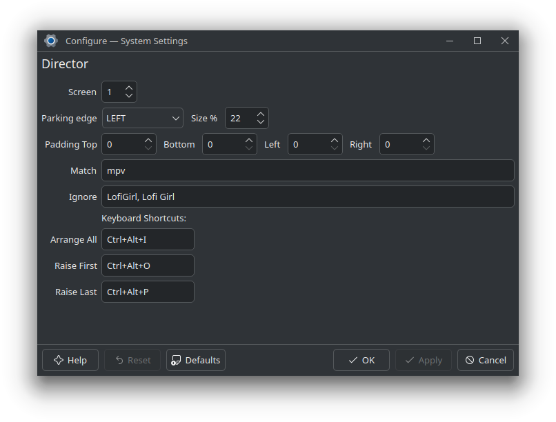

# Director

A KWin script designed to automatically arrange windows, maximizing screen space for one primary window while "parking" the others on the side, allowing you to keep an eye on all of them.

It works with a single screen and a single virtual desktop. It automatically arranges windows on the screen, parks them on the side, and adjusts their sizes to fit the screen, maintain aspect ratio, and maintain titlebar height.

The script is designed to work with a specific set of windows, which can be filtered by caption and whitelisted by caption. The script will automatically arrange all windows that match the filter and are not whitelisted.

The script can be configured to park windows on the top, right, bottom, or left side of the screen, and to adjust the size of the parked windows as a percentage of the screen size.

The script can be configured to arrange all matching windows, raise the first parked window, and raise the last parked window using keyboard shortcuts.

## Screenshots

### configuration

### windows parked on the left side

## Videos

### opening windows

https://github.com/user-attachments/assets/19eb248b-64be-48ae-ba5c-c104e43276bd

### changing focus using the "raise first/last" shortcuts

https://github.com/user-attachments/assets/db4f261f-cbab-43c5-9fe0-f578f81a9490

## What's missing

Using this script mainly for videos (livestreamings), I'd like to mute the parked windows and unmute the main one automatically, but I have no idea if can be done and how (dbus?).
